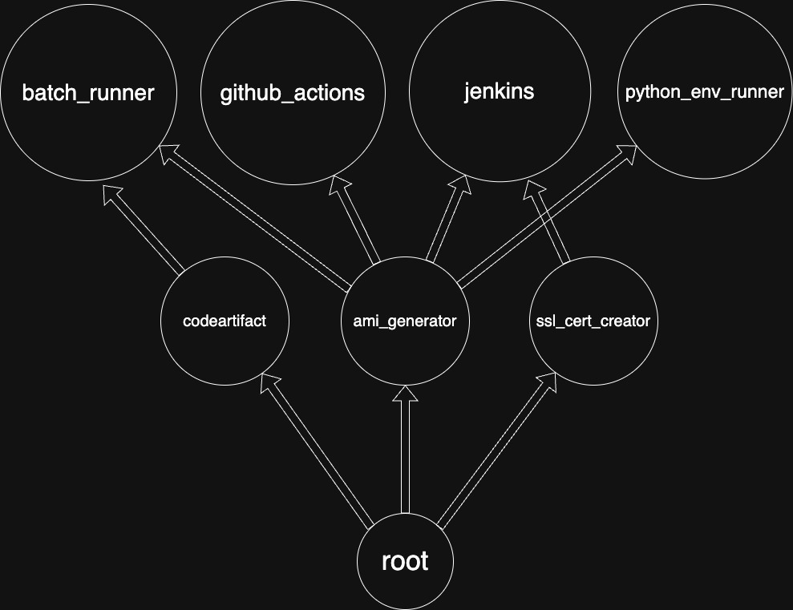

# Welcome To `ofirydevops`

This project is a collection of self-hosted automations that use AWS infra to do usefull stuff.

It includes 8 subprojects:

1. `jenkins`: A creation of a fully configured Jenkins server.
2. `github_actions`: A creation of Github runners on AWS.
3. `python_env_runner`: A python environments builder and runner.
4. `batch_runner`: A general batch runner that use AWS Batch in order to run parallel jobs of what ever you want.
5. `ami_generator`: An AMI builder.
6. `ssl_cert_generator`: An SSL certificates generator (given an existing domain on route53).
7. `codeartifact`: An automation that uploades python packages to AWS Codeartifact
8. `root`: This subproject uploades secrets from your local machine to AWS SSM param store, so that they will be usable when you run on AWS infra.

# Dependencies graph


# Prerequisites

1. An AWS account
2. A Github account
3. Docker running on local machine

# How to build it ?

### 1. Clone the repo to your local machine.
Run this:
```
git clone https://github.com/ofirydevops/ofirydevops.git
cd ofirydevops
```

### 2. Create AWS admin credentials

1. On your AWS account,
Create a IAM user named `admin` and attach it IAM policy named `AdministratorAccess`
2. Create Access Keys for this user.
3. On your local macine, create aws credentials file `~/.aws/credentials`,  
and define an AWS profile with a name of your choosing, with the credentials you created in step 2 (Ill use `OFIRYDEVOPS` for the example):
```
[OFIRYDEVOPS]
aws_access_key_id=<your_aws_access_key_id>
aws_secret_access_key=<your_aws_secret_access_key>
```


### 3. Create the `personal_info_and_secrets.yaml` file

The `personal_info_and_secrets.yaml` file is meant to be used only from your local workstation,  
and is used only by the `root` project,  
which takes the values from this file and store them in SSM Param Store service in your AWS account.  
You need to create this file in the git repo root dir (like README.md).  
Note: This file should be ignored by git because it is defined in the .gitignore file,  
but anyway make sure that this file is indeed ignored by git, so that you will not publish your own secrets in github.  

Run this:
```
touch personal_info_and_secrets.yaml
```

The `personal_info_and_secrets.yaml` file have 6 root level properties:
- `region` (required)
- `profile` (required)
- `namespace` (required)
- `ofirydevops` (optional)
- `tf_backend_config` (required)
- `github_repos` (optional)
- `secrets` (required)

I prepared an exmple file [personal_info_and_secrets.example.yaml](personal_info_and_secrets.example.yaml) 
(with fake values) to demostrate to you how this file should typically look eventually. 

I'll go through each of the properties and explain exactly what they should contain.

#### 1.Set the `region` property
`region` is the AWS region in which your infra will be built.  
Example: `eu-central-1`


#### 2.Set the `profile` property
`profile` must be the AWS profile that you defined in [step 2](#2-create-aws-admin-credentials).  
(I named it `OFIRYDEVOPS` in the example).  
Example: `OFIRYDEVOPS`


#### 3.Set the `namespace` property
`namespace` - A name that will be used to name all the infra you will create,  
in order to allow the creation of multiple environments on the same AWS/Github accounts.  
This string can be at most 7 characters, and must match this regex `^[a-z][a-z0-9]{0,6}$`.  
Example: `bengvir`

#### 4. Set the `ofirydevops` property (optional)
The Jenkins pipelines and Github workflows that will be created by the `github_actions` and `jenkins` projects,  
will by default run code from `ofirydevops/ofirydevops` on git ref `main`.  
You have an option to configure it to be another repo and ref,  
for example - lets say you want to make changes in `ofirydevops/ofirydevops`,  
in order to do that,  
you can fork it to your own Github account, and make it private (or leave it public),  
and then,  
you can add your changes to this repo,  
and make the created Jenkins pipelines and Github workflows  
point to your own `ofirydevops` by defining the `ofirydevops` property, in this format:
```
ofirydevops:
  repo_full_name: <your-github-account-name>/<your-ofirydevops-fork-repo-name>
  ref: <default-git-ref-to-use>
```

For example:  
```
ofirydevops:
  repo_full_name: ofiryy/ofirydevops
  ref: main
```

#### 5. Set the `tf_backend_config` property
1. Create an AWS S3 bucket (with versioning enabled) in your AWS account, on a region of your choosing.  
this bucket will be used as the Terraform S3 backend for all the Terraform projects.

2. Define the `tf_backend_config` property in `personal_info_and_secrets.yaml` file,  
with this content:
```
tf_backend_config:
  bucket: <your-tf-state-s3-bucket-name>
  region: <your-tf-state-s3-bucket-region>
  encrypt: <true|false>
  profile: <aws-profile-with-access-to-bucket>
```
example:
```
tf_backend_config:
  bucket: my-terraform-state-bucket
  region: eu-central-1
  encrypt: true
  profile: OFIRYDEVOPS
```
- The region must be the region of the s3 bucket,  
- The profile can be any existing profile with access to this S3 bucket,  
I just use the admin profile we deifned on [step 2](#2-create-aws-admin-credentials).


#### 6. Set the `github_repos` property (optional)
You have an option to define a list of github repos in your github account,  
so that the `jenkins` and `github_actions` projects will support it by defining webhooks in them.  
These repos would be able to trigger Jenkins pipelines on `jenkins` server,  
and Github workflows on the `github_actions` AWS infra.


#### 7. Set the `secrets` property
In `personal_info_and_secrets.yaml` root level, add a `secrets` property,  
and under it define the folowing variables and their values:

- `github_token`
  - Required for `root`
  - This token will be used for creating and accessing a github repo
  - Create it by following these steps:
    - Go to your github account
    - Click on your user picture in the upper right corner of the github site
    - Click on `Settings`
    - Click on `Developer Settings`
    - Click on `Personal access tokens` => `Tokens (classic)`
    - Click on `Generate new token` => `Generate new token (classic)`
    - Give it a name (I reccomand naming it `ofirydevops-token`)
    - Choose the following permissions:
      - `repo`
      - `workflow`
      - `admin:repo_hook`
      - `delete_repo` (Be carefull with this. If you do not have intention to destroy the `root` project, you can manage without `delete_repo`)

- `github_org`
  - Optional
  - If specified, the repos of the org will be specified in the dropdowns of jenkins pipelines and github workflows in the generated repo.
  - If not specified, the repos in the dropdowns will be the authenticated user personal repos (the user who created the `github_token`). 

- `main_keypair_privete_key`
  - Required for `root`
  - This, along with `main_keypair_pub_key`  
    is the SSH key pair that will be used to access the EC2s that will be defined in the Terraform projects
  - The key pair should be created with this command:  
    ```
    ssh-keygen -t rsa -b 4096 -m PEM -f ~/.ssh/my-ec2-key
    ```
    It will generate 2 files:
      - The private key file: `~/.ssh/my-ec2-key`
      - The public key file: `~/.ssh/my-ec2-key.pub`
  - Define the value of `main_keypair_privete_key` to be the content of `~/.ssh/my-ec2-key`
  - Define the value of `main_keypair_pub_key` to be the content of `~/.ssh/my-ec2-key.pub`
     
- `main_keypair_pub_key`
  - Required for `root`
  - Please see `main_keypair_privete_key` above

- `domain`
  - Required for `jenkins`
  - It must be a route53 domain that is managed on the AWS account we are working on
  - The jenkins server address will be: `https://jenkins.<your-domain>`

- `email`
  - Required for `root`
  - It is used for:
    - Creating the github repo from `root` repo
    - Generating the SSL cert, as the creation process need to recieve an email address.

- `jenkins_admin_username`
  - Required for `jenkins`
  - This will be used to be the admin username of the Jenkins server
  - Reminder: The jenkins server address will be `https://jenkins.<your-domain>`

- `jenkins_admin_password`
  - Required for `jenkins`
  - This will be used to be the admin password of the Jenkins server

- `jenkins_github_app_id`
  - Required for `jenkins`
  - This github app will be used to give the Jenkins server access to your github repos.
  - Create it by following these steps:
    - Go to your github account
    - Click on your user picture in the upper right corner of the github site
    - Click on `Settings`
    - Click on `Developer Settings`
    - Click on `GitHub Apps`
    - Click on `New GitHub App`
    - Give it a name
    - In homepage URL I put: `https://www.jenkins.io/` (I dont understand why is it mandatory)
    - Under `Webhook`, Uncheck the `Active` box
    - In `Repository permissions` define the following:
      - `Checks`: `Read and write`
      - `Commit statuses`: `Read and write`
      - `Contents`: `Read-only`
      - `Pull requests`: `Read-only`
    - Leave all the rest of the default configuration
    - Click on `Create GitHub App`
    - Define `jenkins_github_app_id` value to be the `App ID` number.

- `jenkins_github_app_private_key_converted`
  - Required for `jenkins`
  - This key will be used to give the Jenkins server access to your github repos.
  - Create a private key for the github app you created above (as was instructed under `jenkins_github_app_id`):
    - Go to your github account
    - Click on your user picture in the upper right corner of the github site
    - Click on `Settings`
    - Click on `Developer Settings`
    - Click on `GitHub Apps`
    - Click on the github app you create for Jenkins
    - Scroll down and click on `Generate a private key` - and then the key file will be download to your machine
    - Convert the private key to a different format (so Jenkins could use it):
      - Run this command:
        ```
        openssl pkcs8 -topk8 -inform PEM -outform PEM -in your-github-app-original-private-key.pem -out converted-private-key.pem -nocrypt        
        ```
    - Install this github app:
      - Click on `Install App`
      - Click on `Install`
    - Define the value of `jenkins_github_app_private_key_converted` to be the content of `converted-private-key.pem`

- `gh_actions_runner_github_app_id`
  - Required for `github_actions`
  - This github app will be used to give the `github_actions` runners access to your github repos.
  - Create it by following these steps:
    - Go to your github account
    - Click on your user picture in the upper right corner of the github site
    - Click on `Settings`
    - Click on `Developer Settings`
    - Click on `GitHub Apps`
    - Click on `New GitHub App`
    - Give it a name
    - In homepage URL I put: `https://aws.amazon.com` (I dont understand why is it mandatory)
    - Under `Webhook`, Uncheck the `Active` box
    - In `Repository permissions` define the following:
      - `Actions`: `Read-only`
      - `Checks`: `Read-only`
      - `Administration`: `Read and write`
    - Leave all the rest of the default configuration
    - Click on `Create GitHub App`
    - Define `gh_actions_runner_github_app_id` value to be the `App ID` number.

- `gh_actions_runner_github_app_private_key`
  - Required for `github_actions`
  - This github app will be used to give the `github_actions` runners access to your github repos.
  - Create a private key for the github app you created above (as was instructed under `gh_actions_runner_github_app_id`):
    - Go to your github account
    - Click on your user picture in the upper right corner of the github site
    - Click on `Settings`
    - Click on `Developer Settings`
    - Click on `GitHub Apps`
    - Click on the github app you created in the instructions of `gh_actions_runner_github_app_id`
    - Scroll down and click on `Generate a private key` - and then the key file will be download to your machine
    - Install this github app:
      - Click on `Install App`
      - Click on `Install`
    - Define the value of `gh_actions_runner_github_app_private_key` to be the content of private key file that was downloaded to your machine.


For summary, here is a table that tells you what secrets are required for the subprojects.  
Note: Please consider that if a variable is required for a certain subproject,  
then it is required for all the subprojects that depend on it.

| Variable                                   | Required For                  |
|--------------------------------------------|-------------------------------|
| `github_token`                             | Required                      |
| `github_org`                               | Optional                      | 
| `main_keypair_privete_key`                 | Required                      |
| `main_keypair_pub_key`                     | Required                      |
| `domain`                                   | Required for `jenkins`        |
| `email`                                    | Required for `jenkins`        |
| `jenkins_admin_username`                   | Required for `jenkins`        |
| `jenkins_admin_password`                   | Required for `jenkins`        |
| `jenkins_github_app_id`                    | Required for `jenkins`        |
| `jenkins_github_app_private_key_converted` | Required for `jenkins`        |
| `gh_actions_runner_github_app_id`          | Required for `github_actions` |
| `gh_actions_runner_github_app_private_key` | Required for `github_actions` |


### 6. Build the resources

#### 1. Make sure docker is up and running on your local machine.

#### 2. Build the local deployment dockerfile:
```
docker compose -f deployment/docker/build-tf.yml build
```

#### 3. Build the `root` project:
```
docker compose -f deployment/docker/build-tf.yml up build_root
```

#### 4. Build all the AMIs using `ami_generator`:
```
docker compose -f deployment/docker/build-ami.yml --profile all up 
```

#### 5. Generate SSL cert using `ssl_cert_generator`:
```
docker compose -f deployment/docker/build-ssl.yml up generate_ssl_cert
```

#### 6. Build the `codeartifact` project:
```
docker compose -f deployment/docker/build-tf.yml up build_codeartifact
```

#### 7. Build the `batch_runner` project:
```
docker compose -f deployment/docker/build-tf.yml up build_batch_runner
```

#### 8. Build the `python_env_runner` project:
```
docker compose -f deployment/docker/build-tf.yml up build_python_env_runner
```

#### 9. Build the `github_actions` project:
```
docker compose -f deployment/docker/build-tf.yml up build_github_actions
```

#### 10. Build the `jenkins` project:
```
docker compose -f deployment/docker/build-tf.yml up build_jenkins
```

# How to use it ?

## `github_actions`

After you build on your local workstation these projects:
- [`root`](#3-build-the-root-project) 
- [`ami_generator`](#4-build-all-the-amis-using-ami_generator)
- [`github_actions`](#9-build-the-github_actions-project)

then youll be able to see a new github repo in your github account.  
The name of this repo will be the name of the [namespace](#3set-the-namespace-property).  

In this repo, there will be an open PR, and after you merge this PR,  
you will see that you have github actions workflows available in this repo.  
These workflows run automations with manual trigger (`workflow_dispatch`).

### Github workflows that will be automatically created: 
- `terraform_projects_mgmt`
  - enables you to build the Terraform projects using the github actions runners  
  (instead of running it from the local machine, or from Jenkins)
  - arguments:
    - `Terraform project`
    - `Terraform action to run`

- `python_env_job_runner`
  - A tool for building and running python environments on github_actions runners that you choose.
  - Can run only after `python_env_runner` Terraform project is built
  - Arguments:
    - `Repository` - The repo with the code to run
    - `Repository ref` - The git ref of that repo
    - `Python environment file path` - A path to a file in the repo, that defines the python environment.  
      Example: [py310_full.yaml](python_env_runner/examples/envs/py310_full.yaml).
    - `Job timeout in minutes`
    - `Run command`
    - `Runner node`
  
- `python_env_remote_dev`
  - Similer to `python_env_job_runner`, but just keeping the runner node up for a chosen amount of time  
    to enable SSH connection of the developer to the runner node
  - Can run only after `python_env_runner` Terraform project is built
  - Arguments:
    - `Repository` - The repo with the code to run
    - `Repository ref` - The git ref of that repo
    - `Python environment file path` - A path to a file in the repo, that defines the python environment.  
      Example: [py310_full.yaml](python_env_runner/examples/envs/py310_full.yaml).
    - `Authorized keys file` - A path to a file in the repo, which contain the ssh public ssh keys,  
       whose private keys will have access to the remote machine
    - `Runner node uptime in minutes`
    - `Git user email (Optional)` - Will set the git user you will work with on the runner node.
    - `Runner node`

- `batch_runner_test`
  - A test for `batch_runner` tool 
  - It can run only after `batch_runner` and `codeartifact` Terraform projects are built

- `ami_generator`
  - Generate AMIs (EC2 images)
  - arguments:
    - `AMI conf name`

- `ssl_cert_generator`
  - It is generating/re-generating the SSL certificate of the domain (if exist)
  - You have a limit for amount of times you can do this per domain per week, so dont run it too many times
  - Can run successfully only if a route53 domain was defined, and it is managed in the AWS account 


# How to destroy it ?

#### 1. Destroy the `github_actions` project:
```
docker compose -f deployment/docker/destroy-tf.yml up destroy_github_actions
```

#### 2. Destroy the `jenkins` project:
```
docker compose -f deployment/docker/destroy-tf.yml up destroy_jenkins
```

#### 3. Destroy the `batch_runner` project:
```
docker compose -f deployment/docker/destroy-tf.yml up destroy_batch_runner
```

#### 4. Destroy the `python_env_runner` project:
```
docker compose -f deployment/docker/destroy-tf.yml up destroy_python_env_runner
```

#### 5. Destroy the `codeartifact` project:
```
docker compose -f deployment/docker/destroy-tf.yml up destroy_codeartifact
```

#### 6. Destroy the `root` project:
```
docker compose -f deployment/docker/destroy-tf.yml up destroy_root
```

#### 7. Destroy all Terraform projects except `root`:
```
docker compose -f deployment/docker/destroy-tf.yml --profile all up
```
